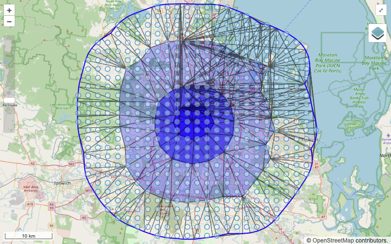

# Fuzzy Geometries SUFF Software
This repo is for the software implementation of the SUFF model in JavaScript, which will be an NPM package as well as an online test UI, ~~available here - [suff.idnau.org](suff.idnau.org)~~ (yet to be deployed).

## Table of Contents

- [The SUFF Model](#the-suff-model)
- [Installation](#installation)
    - [NPM Package](#install-npm)
    - [Test UI](#install-ui)
- [Usage](#usage)
    - [NPM Package](#usage-npm)
    - [Test UI](#usage-ui)
- [Implementation](#implementation)
- [Copyright and License](#copyright-and-license)
- [Contact](#contact)

## The SUFF Model
The [Spatial Uncertainty for Features & Functions (SUFF) model](https://w3id.org/suff/) is a new cutting-edge model to be included in GeoSPARQL 1.3 which provides a way to describe spatial uncertainty in data.

Features in the SUFF model fit into one of three levels of measurement (see diagram below):
- Nominal: No order specified
- Ordinal: Order specified with no certainty values
- "Numeric": Order and certainty values specified, optionally provide 0 & 1 certainty geometries


Credit: Nicholas Car - https://w3id.org/suff/

Example of a SUFF feature in RDF:
```turtle
PREFIX geo: <http://www.opengis.net/ont/geosparql#>
PREFIX rdf: <http://www.w3.org/1999/02/22-rdf-syntax-ns#>
PREFIX rdfs: <http://www.w3.org/2000/01/rdf-schema#>
PREFIX sdo: <https://schema.org/>
PREFIX suff: <http://w3id.org/suff/>
PREFIX xsd: <http://www.w3.org/2001/XMLSchema#>

<https://example.com/feature/feature1>
    a geo:Feature ;
    sdo:name "Test SUFF feature" ;
    geo:hasGeometry [
        a geo:GeometryCollection ;
        rdfs:_1 [
            a geo:Geometry ;
            geo:asWKT "POLYGON ((...))"^^geo:wktLiteral ;
            rdf:value "0.3"^^xsd:double ;
        ] ;
        rdfs:_2 [
            a geo:Geometry ;
            geo:asWKT "POLYGON ((...))"^^geo:wktLiteral ;
            rdf:value "0.5"^^xsd:double ;
        ] ;
        rdfs:_3 [
            a geo:Geometry ;
            geo:asWKT "POLYGON ((...))"^^geo:wktLiteral ;
            rdf:value "0.8"^^xsd:double ;
        ] ;
    ];
.
```

## Installation

<h3 id="install-npm">NPM Package</h3>
To install, run the following using your favourite npm package manager (not yet published):

```bash
pnpm add suff
```
or
```bash
yarn add suff
```
or
```bash
npm install suff
```

<h3 id="install-ui">Test UI</h3>
This project uses [PNPM](https://pnpm.io), so ensure that's installed first. Clone this repo then run the following at the project root directory to install the test UI application on your machine:
```bash
pnpm install
```

## Usage

<h3 id="usage-npm">NPM Package</h3>
An example of importing & using the SUFF package using the blur function:

```javascript
import { blur } from "suff";

const rdfDataStr = "...";

const geometries = blur(rdfDataStr);
```
Functions available from the NPM package (TBD):
- `generate()` - for generating 0 & 1 geometries
- `convert()` - for converting SUFF RDF to GeoJSON
    - option for plain GeoJSON (1 feature with multiple geometries)
    - option for map-friendly GeoJSON (1 feature per geometry)
- `blur()` - for generating contours for blurring with a contour count parameter

<h3 id="usage-ui">Test UI</h3>
Run the following to run a dev server for the test UI application:

```bash
cd suff-rdf
pnpm build
cd ../suff-test
pnpm dev
```

## Software Implementation

1. determine case - nominal, ordinal or "numeric"
2. convert to geojson

3. create 0 & 1 geometries if applicable

4. convert geoms to points and create TIN network

5. sample point grid from TIN network

6. create contours from point grid

7. display a large number of contours with opacity to visualise blurring


## Copyright and License
&copy; Indigenous Data Network 2024. This software is licensed for reuse using the [BSD 3-Clause license](https://opensource.org/license/bsd-3-clause).

## Contact
**Jamie Feiss**  
**Data Infrastructure Developer**  
Indigenous Data Network  
University of Melbourne  
jamie.feiss@unimelb.edu.au
